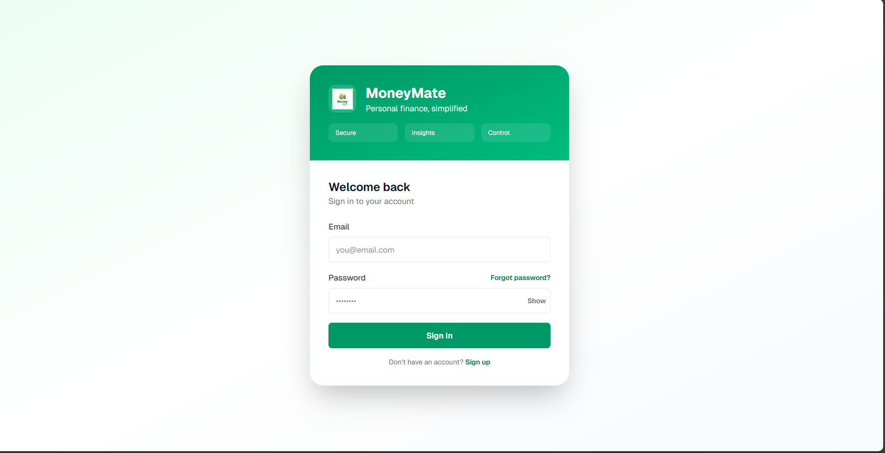
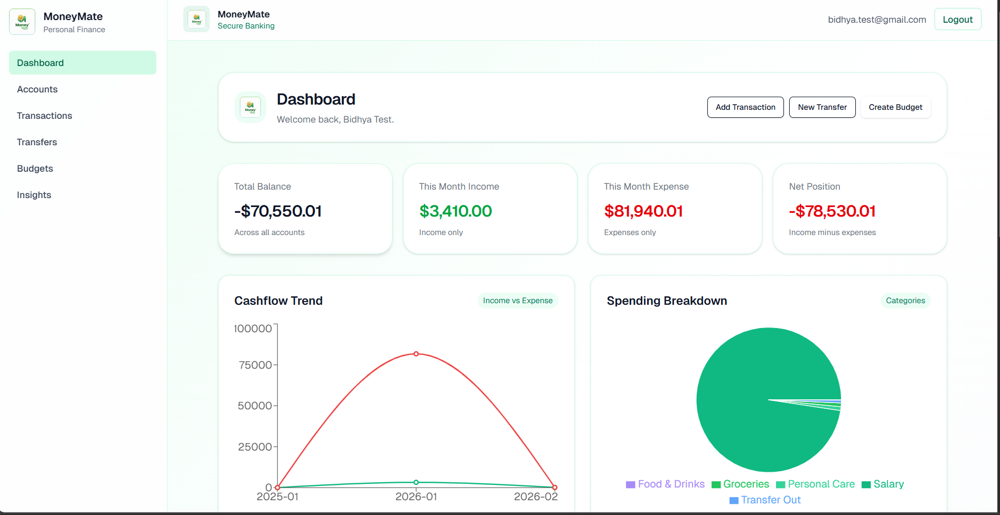

## MoneyMate

**Full‑Stack Personal Finance Platform**

### Live application

- Web: `https://money-mate-fintech-app.vercel.app/`

### Overview

MoneyMate is a full-stack personal finance platform designed to help users manage accounts, track transactions, control budgets, and generate intelligent financial insights.

The system includes:

- A secure **Express + MongoDB** API with cookie-based authentication
- A modern **Next.js (App Router)** frontend built with React and TypeScript
- AI-powered monthly financial summaries
- OCR-based receipt parsing
- Email-based password recovery workflows

The application emphasizes secure authentication, structured financial data modeling, and production-ready deployment practices.

### Screenshots (optional)

Add these files to `docs/images/` and update the links below:

- Sign in: `docs/images/signin.png`
- Sign up: `docs/images/signup.png`
- Dashboard: `docs/images/dashboard.png`

## Architecture

```
MoneyMate
├── backend/         → Express API (Node.js, MongoDB, JWT auth)
└── moneymate-web/   → Next.js frontend (React, TypeScript, Tailwind)
```

## Authentication model

- JWT tokens stored in **HttpOnly** cookies
- CORS configured with **credential support**
- Secure cookie settings for production environments

## Core features

### Authentication & security

- Email/password authentication
- JWT stored in HttpOnly cookies
- Secure password reset flow via email
- Production-safe CORS and cookie configuration

### Account management

- Create, update, and archive financial accounts
- Track balances and optional financial goals
- Real-time balance updates

### Transactions

- Income and expense tracking
- Category assignment
- Statement-style transaction view
- Archive support

### Transfers

- Move funds between accounts
- Status tracking

### Budgets

- Category-based budgeting
- Threshold alerts
- Visual progress tracking

### Insights & analytics

- Cashflow trend visualization
- Category breakdown charts
- KPI summary cards
- Net position calculation

### AI financial report

- Monthly AI-generated financial summary
- Provider fallback support:
  - Gemini
  - Groq (OpenAI-compatible)
  - OpenAI

### Receipt processing

- OCR extraction via `tesseract.js`
- Receipt parsing workflow
- Optional receipt attachment to transactions (storage provider configurable)

## Technology stack

### Frontend

- Next.js (App Router)
- React
- TypeScript
- Tailwind CSS
- Recharts

### Backend

- Node.js
- Express
- MongoDB (Mongoose)
- JWT authentication
- Zod validation

### AI & OCR

- Gemini / Groq / OpenAI (configurable)
- `tesseract.js`

### Email

- SMTP (Nodemailer)
- Resend (optional)

## Local development

### Prerequisites

- Node.js 18+
- npm
- MongoDB (local or Atlas)

### Backend setup

```bash
cd backend
cp .env.example .env
npm install
npm run dev
```

Default backend URL: `http://localhost:5000`

### Frontend setup

```bash
cd moneymate-web
cp .env.example .env.local
```

Set `NEXT_PUBLIC_API_URL` in `moneymate-web/.env.local`:

```env
NEXT_PUBLIC_API_URL=http://localhost:5000
```

Then run:

```bash
npm install
npm run dev
```

Frontend runs on: `http://localhost:3000`

## Environment variables

### Backend (`backend/.env`)

Required:

- `MONGO_URI`
- `JWT_SECRET`
- `NODE_ENV`
- `PORT`
- `FRONTEND_URL`

Password reset:

- `PASSWORD_RESET_URL_BASE`

Email (choose one):

- SMTP: `SMTP_HOST`, `SMTP_PORT`, `SMTP_USER`, `SMTP_PASS`, `SMTP_FROM`
- Resend (optional): `RESEND_API_KEY`, `RESEND_FROM`

AI providers (optional):

- `GEMINI_API_KEY`
- `GROQ_API_KEY`
- `OPENAI_API_KEY`

Upload control:

- `ENABLE_UPLOADS=true`
- `DISABLE_UPLOADS=true`

### Frontend (`moneymate-web/.env.local`)

- `NEXT_PUBLIC_API_URL`

## Deployment considerations

### Cookie configuration (production)

Ensure:

- `secure: true`
- `sameSite: "none"`
- `httpOnly: true`
- `app.set("trust proxy", 1)`

CORS must allow credentials.

### Serverless upload limitation

Local disk storage does not persist in serverless environments.

Receipt uploads are typically:

- Disabled by default in production, or
- Stored using object storage (Cloudinary / S3 / R2)

## Scripts

### Backend

```bash
cd backend
npm run dev
npm start
npm test
```

### Frontend

```bash
cd moneymate-web
npm run dev
npm run build
npm start
npm test
```

## CI/CD

- Frontend: automatic deployment via Vercel
- Backend: designed for GitHub Actions CI integration
- Supports automated testing pipelines

## Security practices

- Secrets stored in environment variables
- `.env` files excluded from version control
- Cookie-based authentication
- Input validation via Zod

## License

MIT License





